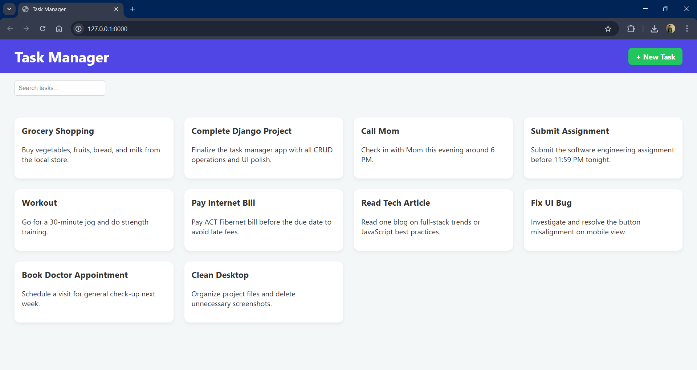
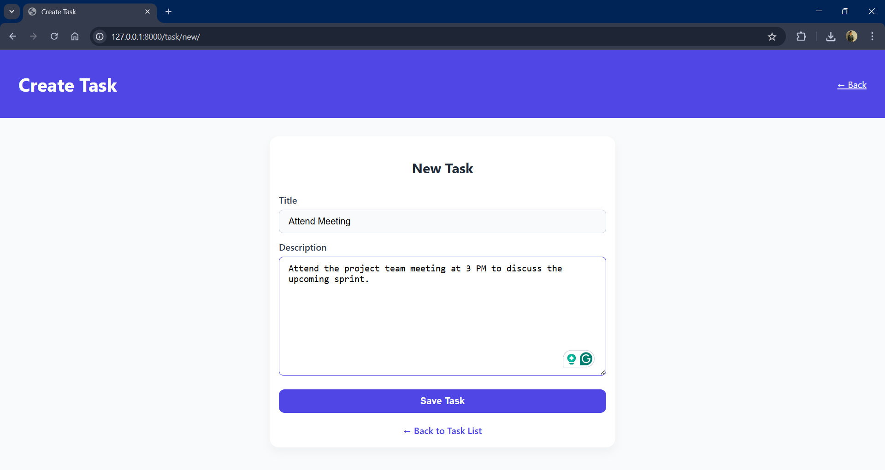
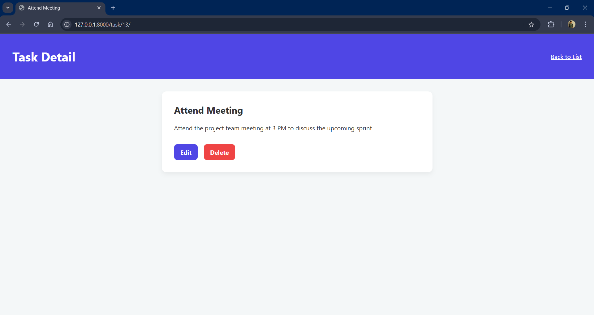
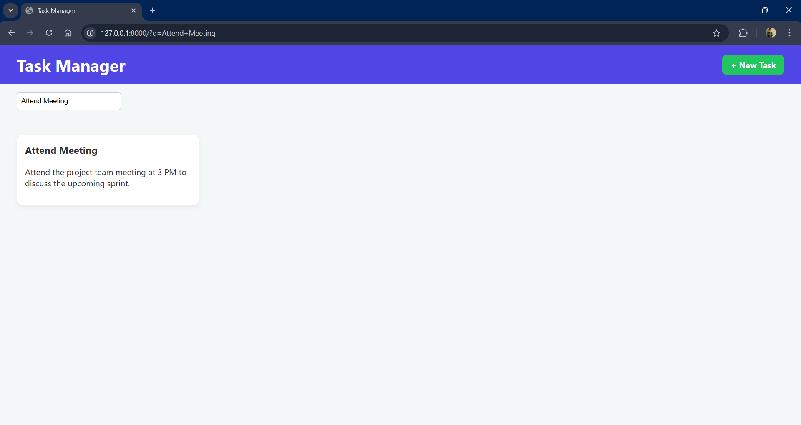

# 📝 Task Manager Web Application

## 📌 Overview

A simple and modern web application for managing daily tasks. Users can create, update, delete, and search tasks, all presented in a clean card-based interface. Built using the Django framework and PostgreSQL, the app showcases full-stack development skills.

---

## 🚀 Features

- ✅ Create a new task with title and description
- ✏️ Edit existing tasks
- ❌ Delete tasks
- 🔍 Search tasks by title
- 📋 Task cards display summary
- 🔎 Click a card to view task details
- 🎨 Responsive UI/UX with modern layout

---

## 🛠 Technologies Used

### Frontend

- HTML5
- CSS3
- JavaScript

### Backend

- Python 3.x
- Django 4.x

### Database

- PostgreSQL

### Database Schemas

1. Task Table
   This table stores all the tasks with attributes like title, description, and creation date.

- id: Auto-incremented primary key to uniquely identify each task.
- title: A short text field (string) to store the task name.
- description: A text field to store the detailed description of the task.
- created_at: The timestamp when the task is created (auto-generated by the database).

### Tools

- Django Admin
- Git & GitHub
- VS Code

---

## 🧑‍💻 Working

1. **Homepage**: Lists all tasks inside a main card layout.
2. **Create**: Users click "Create Task" to submit a new task.
3. **Read**: All tasks shown as individual cards.
4. **Update**: Tasks can be modified via an edit button.
5. **Delete**: Tasks can be deleted permanently.
6. **Search**: Search bar filters tasks by title.
7. **Detailed View**: Clicking a task card opens its full content.

---

## 🧱 Project Structure

```
TaskManager/
├── manage.py
├── taskapp/
│   ├── migrations/
│   ├── static/
│   ├── templates/
│   │   ├── task_list.html
│   │   ├── task_detail.html
│   │   ├── task_form.html
│   ├── models.py
│   ├── views.py
│   ├── urls.py
├── TaskManager/
│   ├── settings.py
│   ├── urls.py
```

---

## 🔮 Future Enhancements

- User Authentication
- Task Priority (Low, Medium, High)
- Due Dates and Reminders
- Task Categories or Tags
- Drag-and-Drop Sorting
- Dark Mode Toggle

---

## 📷 Screenshots






---

## 📄 License

This project is open-source and available under the MIT License.

---

## 🙋‍♂️ Author

**Vansh Parekh**
